<div align="center">

# 🌿 LeafInsight: Smart Detection of Vegetable Diseases using Deep Vision

> An end-to-end, deep learning-powered mobile application that detects leaf diseases in vegetable crops (Potato, Tomato, and Bell Pepper) with a 95.5% accurate MobileNetV2 model, coupled with a FastAPI backend and GPT-4o Generative AI advice in English and Urdu.

🎬 **Watch the Project Demonstration Video:** [Google Drive Demo Video Link](https://drive.google.com/file/d/1VALiZEMeCaDllaFSyt0wOSRRQzzVTlJj/view?usp=drive_link)

[](https://reactnative.dev/)
[](https://fastapi.tiangolo.com/)
[](https://www.tensorflow.org/)
[](https://openai.com/)
[](https://strapi.io/)

</div>

---

## 🌟 Overview

In modern agriculture, early detection of plant diseases is critical for growing healthy crops and reducing yield losses. Traditional methods to identify plant diseases are often slow, subjective, and require expert agronomists, making them inaccessible to smallholder farmers. 

**LeafInsight** is a full-stack, AI-driven mobile solution designed to identify diseases in vegetable crops — specifically **Potato**, **Tomato**, and **Bell Pepper (Capsicum)**. By analyzing leaf photographs using a custom **MobileNetV2** deep convolutional neural network, the app detects diseases with **95.5% accuracy**. Once classified, the app integrates with **OpenAI's GPT-4o** to generate real-time diagnostic blogs detailing the symptoms, causes, organic treatments, and care tips in both **English** and **Urdu**.

---

## 📱 Mobile App UI Showcase

Here are some screenshots taken from the **LeafInsight React Native** mobile application showing registration, onboarding, camera scanning, analysis results, and generated agricultural advisory blogs:

<table align="center">
  <tr>
    <td align="center" width="50%"><br/><b>🔐 Login Screen</b></td>
    <td align="center" width="50%">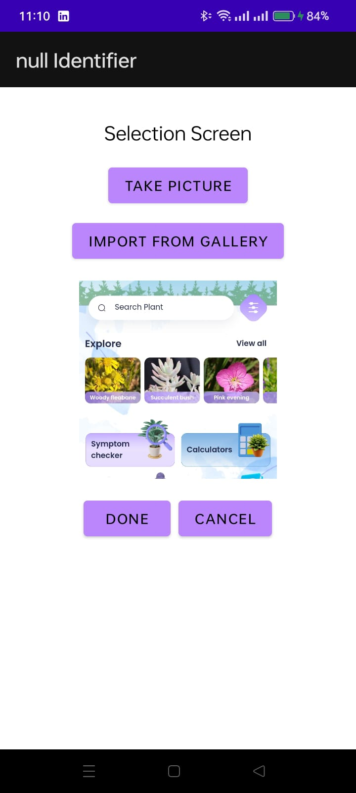<br/><b>📝 Signup Screen</b></td>
  </tr>
  <tr>
    <td align="center" width="50%">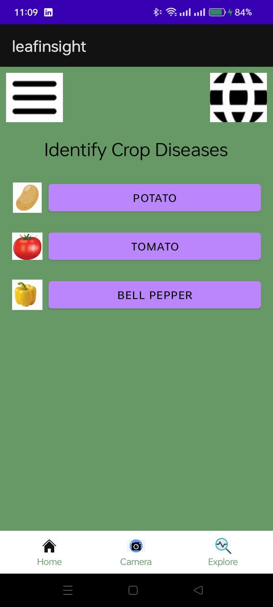<br/><b>🌱 Explore Crops</b></td>
    <td align="center" width="50%">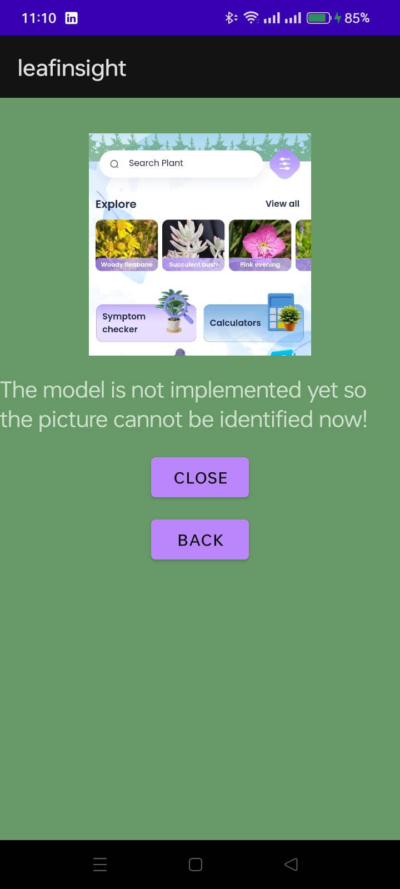<br/><b>📸 Camera Scan UI</b></td>
  </tr>
  <tr>
    <td align="center" width="50%">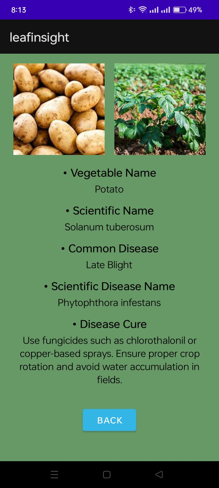<br/><b>🔬 AI Diagnosis Result</b></td>
    <td align="center" width="50%">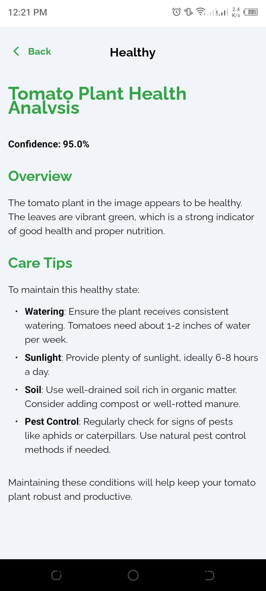<br/><b>📋 Diagnosis Detail 1</b></td>
  </tr>
  <tr>
    <td align="center" width="50%">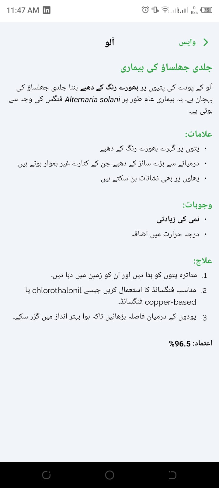<br/><b>📜 Diagnosis Detail 2</b></td>
    <td align="center" width="50%">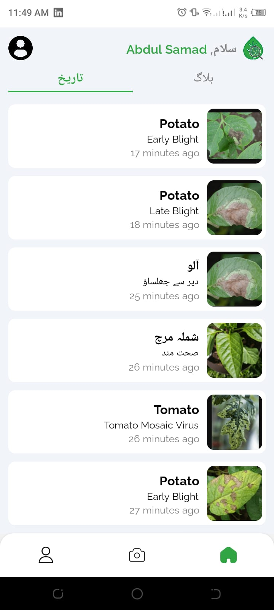<br/><b>💡 Diagnosis Detail 3</b></td>
  </tr>
</table>

---

## 📊 Technical Diagrams & Training Insights

The project evaluated several architectures, including **MobileNetV2**, **VGG16**, **ResNet50**, **EfficientNetB0**, and **InceptionV2**. Below are the model parameters, network structures, and accuracy/loss curves obtained during final evaluation:

### 1. Training Performance (Accuracy & Loss Curves)
<div align="center">
  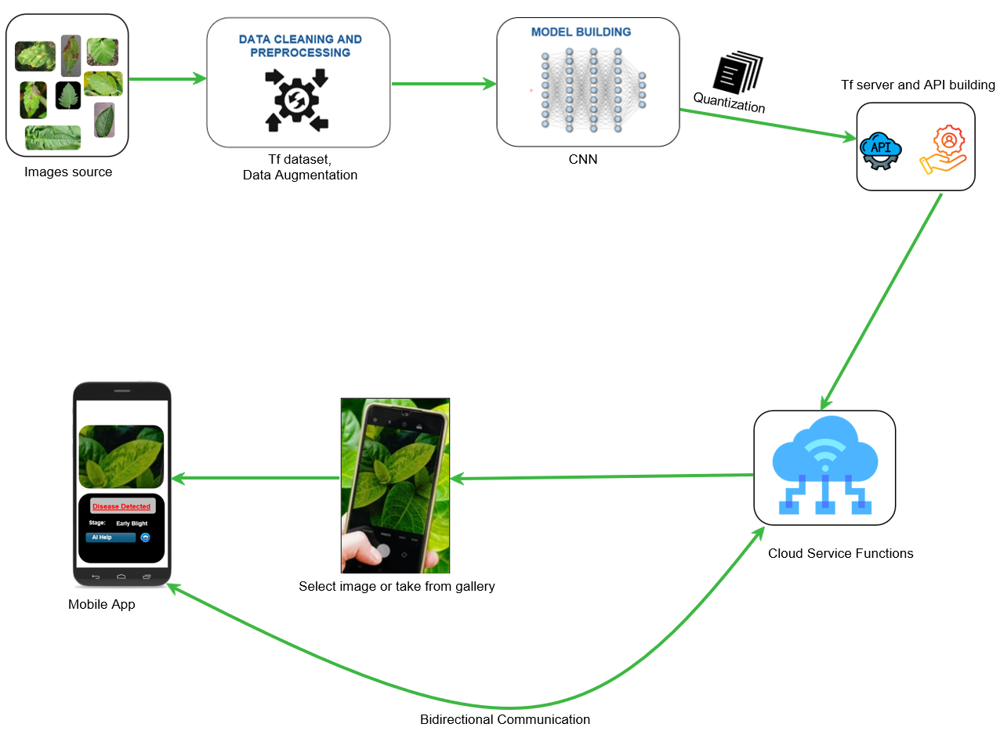
</div>

### 2. Model Evaluation Metrics (Confusion Matrix & Classification Report)
<div align="center">
  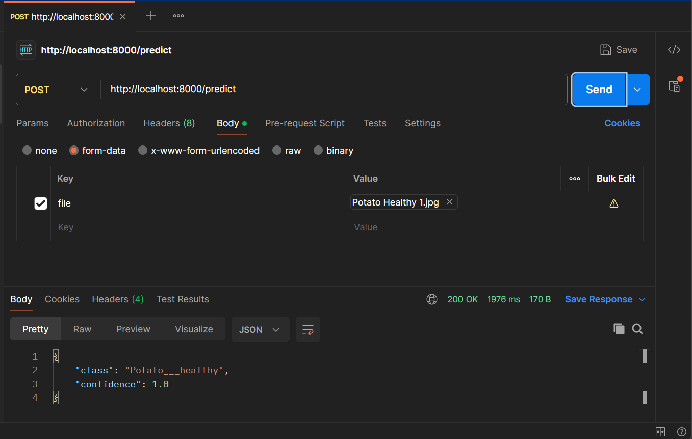
  <br/><br/>
  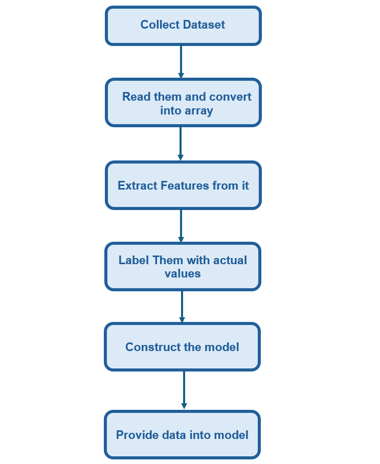
</div>

### 3. System Architecture & Flow Diagrams
<div align="center">
  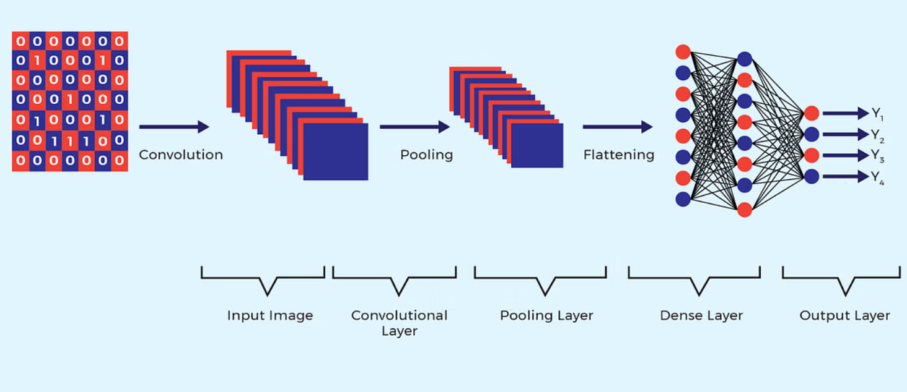
  <br/><br/>
  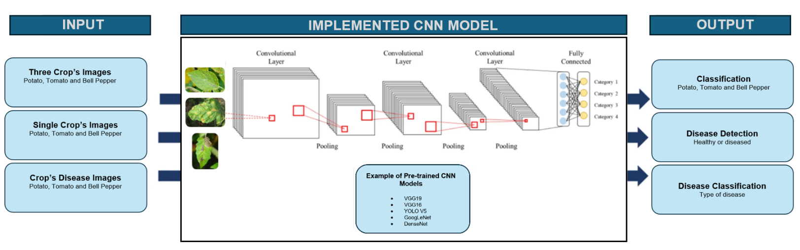
</div>

---

## ✨ Key Features

- **📸 Instant Smartphone Diagnostics**: Take a photo of a diseased leaf using the mobile camera or upload from gallery to receive an immediate diagnosis.
- **⚡ 95.5% Accurate CNN**: Leverages a trained MobileNetV2 architecture, optimized specifically for fast CPU/mobile execution without sacrificing accuracy.
- **🤖 Generative AI Treatment Plan**: Sends positive classifications to OpenAI GPT-4o to formulate a markdown blog containing:
  - **Symptoms**: What to look out for on other leaves.
  - **Causes**: Weather, soil, or biological triggers.
  - **Treatment**: Chemical & organic solutions.
  - **Care Tips**: Preventative steps for future crops.
- **🗣️ Bilingual Support (Urdu & English)**: Supports Urdu queries and outputs. Translation mapping translates terms like `Potato_Early_blight` to local Urdu terminology (`آلو — آگ جلنے کی ابتدائی بیماری`).
- **🛡️ Out-of-Distribution (OOD) Protection**: Built-in safety mechanisms in FastAPI. If the confidence level is below **90%** or the image contains non-plant objects, it responds with *"Picture cannot be identified"* to prevent false diagnostics.
- **📦 Strapi CMS Integration**: Integrated Strapi admin dashboard to manage plant metadata, disease archives, and application news updates.

---

## 🛠️ Tech Stack

### Mobile Frontend
- **Framework**: React Native (v0.72)
- **Language**: TypeScript
- **State Management**: React Hooks & Context API
- **Design Pattern**: Minimalist agricultural green theme with vector icon badges

### Backend API
- **Framework**: FastAPI (Python 3.10+)
- **WSGI Server**: Uvicorn
- **AI Integrations**: TensorFlow/Keras & OpenAI API (GPT-4o model)

### Machine Learning Model
- **Engine**: TensorFlow / Keras (Saved as `.keras` format)
- **Base Architecture**: MobileNetV2
- **Dataset**: Customized PlantVillage dataset including Potato, Tomato, and Bell Pepper leaves
- **OOD Handling**: Custom threshold filtering (<90% confidence or "Unknown_Objects")

### Content Management
- **CMS**: Strapi CMS v4 (NoSQL/SQL database-backed)
- **Purpose**: Manage agricultural blogs, explore section materials, and user archives

---

## 🦠 Crop & Disease Class Matrix

LeafInsight classifies crop leaves into **8 distinct labels**:

| Crop | Disease | Status / Translation (Urdu) |
| :--- | :--- | :--- |
| **Potato** | Early Blight | آگ جلنے کی ابتدائی بیماری |
| **Potato** | Late Blight | آگ جلنے کی آخری بیماری |
| **Potato** | Healthy | صحت مند |
| **Tomato** | Mosaic Virus | موزیک وائرس |
| **Tomato** | Healthy | صحت مند |
| **Bell Pepper** | Bacterial Spot | بیکٹیریا کے دھبے |
| **Bell Pepper** | Healthy | صحت مند |
| **Any / Other** | Non-plant/Noise | Unknown Objects (Not Identified) |

---

## 🚀 Getting Started

To run the full-stack LeafInsight application locally, follow the steps below:

### 1. Backend Server Setup (FastAPI)
1. Navigate to the FastAPI directory:
   ```bash
   cd FastAPI
   ```
2. Create and activate a virtual environment:
   ```bash
   python -m venv venv
   source venv/bin/activate  # On Windows: venv\Scripts\activate
   ```
3. Install dependencies:
   ```bash
   pip install -r requirements.txt
   ```
4. Create a `.env` file in the `FastAPI` directory:
   ```env
   OPENAI_API_KEY=your_openai_api_key_here
   API_TOKEN=my-secret-token
   PORT=8000
   ```
5. Run the FastAPI development server:
   ```bash
   python main.py
   ```

---

### 2. Strapi CMS Setup
1. Navigate to the Strapi CMS directory:
   ```bash
   cd leafinsight-strapi-main
   ```
2. Install Node packages:
   ```bash
   npm install # or yarn install
   ```
3. Run the development server:
   ```bash
   npm run develop
   ```
4. Open your browser to `http://localhost:1337/admin` to set up your administrator credentials.

---

### 3. Mobile App Setup (React Native)
1. Navigate to the mobile app directory:
   ```bash
   cd LeafInsightRN-main
   ```
2. Install npm packages:
   ```bash
   npm install # or yarn install
   ```
3. Start the Metro Bundler:
   ```bash
   npm start # or yarn start
   ```
4. Run on your platform of choice:
   - **Android**: `npm run android`
   - **iOS**: `npm run ios` (Requires macOS and CocoaPods setup)

---

## 📄 License

```
MIT License

Copyright (c) LeafInsight --- 2026 AnasQ2003🌿

Permission is hereby granted, free of charge, to any person obtaining a copy
of this software and associated documentation files (the "Software"), to deal
in the Software without restriction, including without limitation the rights
to use, copy, modify, merge, publish, distribute, sublicense, and/or sell
copies of the Software, and to permit persons to whom the Software is
furnished to do so, subject to the following conditions:

The above copyright notice and this permission notice shall be included in all
copies or substantial portions of the Software.

THE SOFTWARE IS PROVIDED "AS IS", WITHOUT WARRANTY OF ANY KIND, EXPRESS OR
IMPLIED, INCLUDING BUT NOT LIMITED TO THE WARRANTIES OF MERCHANTABILITY,
FITNESS FOR A PARTICULAR PURPOSE AND NONINFRINGEMENT.
```

---

## 👨‍💻 Author

**Anas Ahmed Qureshi** — [@AnasQ2003](https://github.com/AnasQ2003)

---

<div align="center">

Built with ❤️ by **Anas**

Made with 🔥 and a lot of ☕

**⭐ If you found this useful, please star the repository!**

</div>

